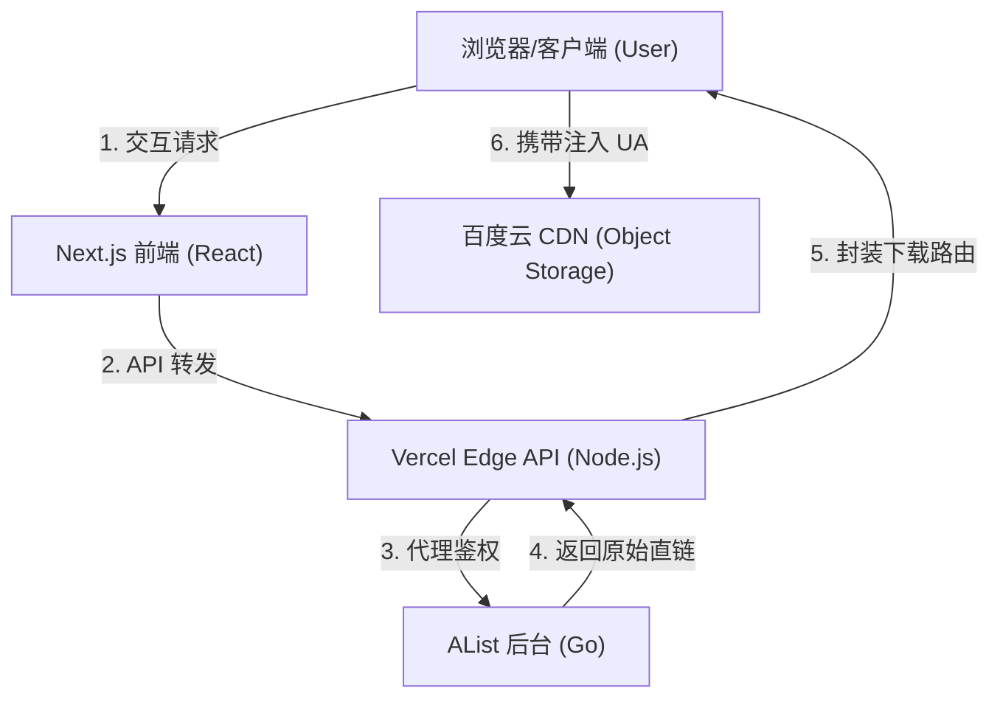

# 百度网盘 New ProMax 教程 v2

## 一、 基本信息
- **登录新版网址**：[https://pan.cdqzsta.tech](https://pan.cdqzsta.tech)
- **AList 原始接口**：
    - 访问网址 (IPv6)：`https://alist.0d000721.ltd:45567`
    - 访问网址 (IPv4)：`https://frp-gap.com:37492`
    > [!TIP]
    > 如果你不知道该用哪一个，请优先尝试 IPv6，不行再换用 IPv4。

## 二、 登录
- **游客**：点击“以游客身份登录”按钮直接进入。
- **老用户**：如果你拥有专属账号，可以使用账号密码登录。
- **外观切换**：点击右下角的“月亮/太阳”图标即可开启或关闭深色模式（玻璃拟态效果在深色模式下更佳）。

## 三、 页面简介
登录后进入主界面，右上角有简单说明。操作逻辑与普通网盘一致，支持文件浏览、预览与下载。

## 四、 下载逻辑详解（重点）
由于百度网盘对 **≥20MB** 的文件会强制验证请求头 `User-Agent: pan.baidu.com`，普通浏览器或手机端直接下载会报错 403。为此，本站设计了以下逻辑：

> [!IMPORTANT]
> **点击下载后请耐心等待**。系统正在后台解析获取最优直链，并非网页卡死。

### 1. 🔹 小文件 ( < 20MB )
- **触发方式**：直接在列表中点击。
- **特点**：触发浏览器原生下载，直链提取，速度极快，无需配置。

### 2. 🔹 大文件 ( ≥ 20MB )
点击后会弹出 3 种优化下载方案：

- **☁️ Cloudflare 边缘加速（强烈推荐，手机端福音）**
    - **原理**：通过海外部署的 Cloudflare Workers 节点进行中转，在云端自动补齐缺失的 `User-Agent`。
    - **优势**：完美解决手机端无法修改 UA 的痛点。无需任何配置，点击即下。由于 CF 节点带宽充裕，基础速度可达 9MB/s 以上。
    - **注意**：短时间内（1分钟内）多次发起请求可能会触发布发商限速。

- **🚀 复制直链（最高速选择）**
    - **原理**：直接暴露真实的百度原生 CDN 链接（含时效签名）。
    - **配合要求**：**必须**配合桌面端多线程工具（如 NDM/IDM），且必须在软件设置内手动加入 `User-Agent: pan.baidu.com`。
    - **优势**：满速方案，最高可达 50MB/s+（取决于你的实际带宽）。

- **🔥 服务器中转下载（备用及故障兜底）**
    - **原理**：由 STA 后端服务器直接拉取百度流量并转发至你的设备。
    - **优缺点**：极其稳定且速度尚可，但由于服务器月流量有限（限额 7GB/月），建议仅在上述方案均失效时作为兜底使用。

## 五、 文件预览
目前支持以下格式的在线预览：
- **图片**：jpg, jpeg, png, gif, webp, svg, bmp, ico
- **视频**：mp4, webm, ogg, mov
- **文本/代码**：txt, md, log, json, csv, xml, html, css, js, ts, tsx, py, java, c, cpp, h, yaml, yml, ini, cfg, conf, sh, bat, sql, go, rs, rb, php, swift, kt
- **文档**：PDF

## 六、 技术原理 (精细化深度版)

本项目并非简单的 UI 壳子，而是一套基于 **Next.js App Router** 构建的轻量化中转网关，旨在通过技术手段突破百度网盘的各类下载限制。

### 1. 技术架构全景
项目的核心任务是处理 **AList 后端** 与 **最终浏览器/客户端** 之间的跨域、鉴权与 UA 校验冲突。



### 2. AList 连接与代码实现
本站的 `baidu-pan-alist/src/app/api/alist/route.ts` 承担了鉴权桥接任务：
- **静默授权**: 前端无需用户感知 AList 密码。后端利用环境变量中的 `ALIST_PASSWORD` 与 AList 握手获取 `token` 并缓存。
- **请求代理**: 当用户点击文件，前端调用 `/api/alist`（Action: `get`）。后端会拦截该请求，并代为向 AList 请求对应文件的真实原始 URL（含临时签名）。
- **权限透传**: 整合了用户角色校验。仅在后端验证过用户 Token 后，才会下发对应的 AList 操作指令。

### 3. 下载加速的技术堡垒
- **Cloudflare 边缘加速**: 利用 Cloudflare 全球分布的边缘节点，在流量经过时由边缘脚本（Workers）动态补全百度所需的 `User-Agent` 与 `Referer`。
- **服务器中转 (Server Proxy)**: 
    ```typescript
    // 核心代码实现原理
    const baiduRes = await fetch(rawUrl, {
      headers: { 'User-Agent': 'pan.baidu.com' }
    });
    // 使用 ReadableStream 流式转发，降低服务器内存占用
    return new Response(baiduRes.body, { headers: { ... } });
    ```

### Q: 它是如何把 AList 里的文件显示过来的？
**A**: 本站部署在高性能 Vercel 节点上，通过 Node.js 后端与 AList 接口通信。当你打开页面时，后端会根据配置的密钥去 AList 拉取文件树并实时渲染在你的屏幕上。

### Q: 下载原理到底是怎么回事？
**A**: 
1. **Cloudflare 方案**：利用 Serverless 技术，在流量经过 CF 边缘节点时，由脚本动态注入百度所需的 Headers。
2. **服务器中转**：由后端服务器发起 `fetch` 请求读取百度二进制流，再使用 Node.js 的 `ReadableStream` 管道（Pipe）技术透传给用户。
3. **直链下载**：直接调用 AList 的 `/d` 接口获取原始签名链接，由用户本地客户端负责所有握手过程。

## 七、 常见问题 (Q & A)

> [!IMPORTANT]
> **Q: 为什么我下载大文件还是报错 403？**
> A: 百度网盘有严格的 UA 限制。若非使用 Cloudflare 或服务器中转模式，请确保你的下载工具（如 IDM）已将 User-Agent 修改为 `pan.baidu.com`。

> [!TIP]
> **Q: 网站会存储我的百度账号信息吗？**
> A: 绝不。所有账号信息仅保存在底层的 AList 实例中，本站仅通过 API 进行指令传递，不接触任何私密数据。

---
*© 成都七中科学技术协会 (STA).*
